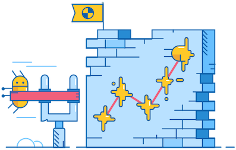

## Hi there 👋, my name is Bobby Galli

## 🙋‍♂️ About me

I'm from the USA 🇺🇸, and am currently located in the Eastern Standard Time-Zone 🌎. I'm a huge fan of Node.js, TypeScript, open-source, and writing testable software 💻. When I'm not crushing bugs or building dreams I can be found playing golf 🏌️, playing hockey 🏒, snowboarding 🏂, lifting weights 🏋️, and spending time with my beautiful fiancé Cassie ❤️.

## 🔭 I'm currently working on

## 🌱 I’m currently learning

## 🔨 I've contributed to

| Repository              | Link                                                    |
|-------------------------|---------------------------------------------------------|
| Angular                 | https://github.com/angular/angular/pull/43621           |
| Hotjar                  | https://github.com/hotjar/hotjar-js/pull/10             |
| NgxCharts               | https://github.com/swimlane/ngx-charts/pull/1637        |
| ngb-filterable-dropdown | https://github.com/BugSplat-Git/ngb-filterable-dropdown |
| ngx-animated-counter    | https://github.com/BugSplat-Git/ngx-animated-counter    |
| ngx-toggle              | https://github.com/bobbyg603/ngx-toggle                 |
| is-image-web            | https://github.com/bobbyg603/is-image-web               |
| is-video-web            | https://github.com/bobbyg603/is-video-web               |
| is-video                | https://github.com/sindresorhus/is-video/pull/5         |

## ✍️ I've written about

- [How to Build a Linux Shared Library](https://medium.com/better-programming/how-to-build-a-linux-shared-library-f5b574b0c08e)
- [Git-Filter-Repo Submodule Extraction](https://levelup.gitconnected.com/git-filter-repo-submodule-extraction-fb84de4c0ed6)
- [How To Build a Strongly Typed Angular 14 Super Form](https://betterprogramming.pub/how-to-build-a-strongly-typed-angular-14-super-form-86837965a0e5)
- [3 and 1/2 Reasons Why Your Tests Should Be Stateless](https://betterprogramming.pub/3-and-1-2-reasons-why-your-tests-should-be-stateless-ad93441705fe)
- [File Uploads with Angular and RxJS](https://medium.com/better-programming/file-uploads-with-angular-and-rxjs-34262b3450ae)
- [CI/CD for Angular Developers](https://medium.com/@bobbyg603/ci-cd-for-angular-developers-be9a1485d22b)
- [GitHub Status Checks and Branch Protection Made Easy](https://medium.com/@bobbyg603/github-status-checks-and-branch-protection-made-easy-b70d6d9ffc76)
- [Unit Testing in 2022](https://medium.com/@bobbyg603/unit-testing-software-in-2022-b3ac00962c65)
- [Crash Course in Crash Grouping](https://www.bugsplat.com/blog/product/crash-course-in-grouping/)
- [Customizing the Unreal Engine Crash Report Client Dialog](https://www.bugsplat.com/blog/game-dev/customizing-ue4-crash-dialog/)
- [How to Build Crashpad (C++ Crash Reporter)](https://docs.bugsplat.com/introduction/getting-started/integrations/cross-platform/crashpad/how-to-build-google-crashpad)

## 💸 How to support me

[1JEmxKZhh4ix8FfsN1Jhe1XdMpu7PEfEm1](https://www.blockchain.com/btc/address/1JEmxKZhh4ix8FfsN1Jhe1XdMpu7PEfEm1)

## 📫 How to reach me

